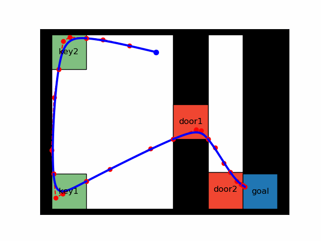
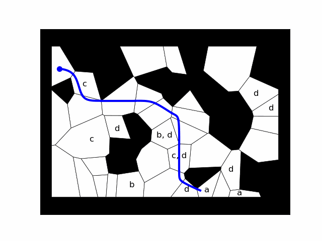
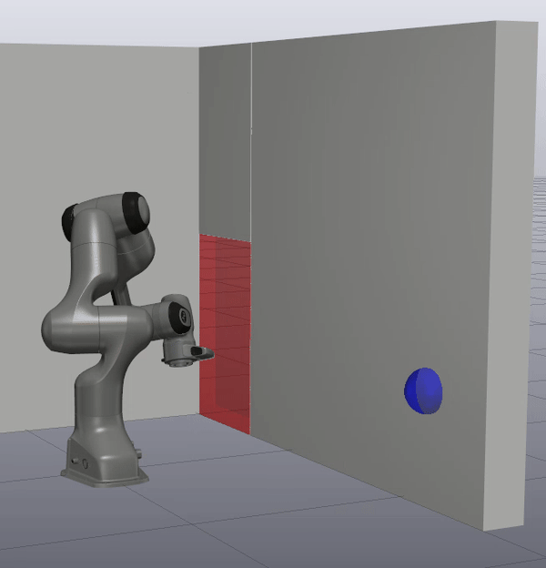

# Temporal Logic Motion Planning with Graphs of Convex Sets

A fast and scalable motion planning framework for tasks expressed in Linear Temporal Logic (LTL). 

This repository contains code to accompany the paper *Temporal Logic Motion
Planning with Convex Optimization via Graphs of Convex Sets* by Vince Kurtz and
Hai Lin. 

## Installation

## Dependencies

- [pydrake](https://drake.mit.edu/)
- [mona](https://www.brics.dk/mona/download.html)
- [ltlf2dfa](https://github.com/whitemech/LTLf2DFA)
- [MOSEK](https://www.mosek.com/) (license only: installed with pydrake)
- treelib
- matplotlib
- scipy
- sympy
- numpy
- graphviz
- pydot
- pickle

## Examples

The following examples and several other can be found in the `examples`
directory.

### Key-door puzzle

Don't pass through a door until picking up a corresponding key, and eventually
reach a goal.

LTL specification:

$$
\varphi = (\lnot door\_1 \mathsf{U} key\_1) \land (\lnot door\_2 \mathsf{U} key\_2) \land \lozenge goal
$$

Solution:

File: `examples/key_door.py`

### Large key-door puzzle

A similar task, but with more keys and doors. 

LTL specification:

$$
\varphi = \bigwedge\_{i=1}^5 (\lnot d\_i \mathsf{U} k\_i) \land \lozenge goal
$$

Solution:

File: `examples/door_puzzle.py`

### Randomly-generated multi-target scenario

Eventually visit $a$, $c$, and $d$, and always avoid $b$:

LTL specification:

$$
\varphi = \lozenge a \land \square \lnot b \land \lozenge c \land \lozenge d
$$

Solution:

File: `examples/random_polytopes.py`

### Franka Panda Manipulator Arm

Eventually reach a target, and don't pass through a doorway until pressing a button. For this example, run the `drake-visualizer` to view the result. 

LTL specification:

$$
\varphi = \lozenge target \land \lnot doorway \mathsf{U} button
$$

Solution:

File: `examples/robot_arm.py`

### Atlas Humanoid

Touch the green target with the left hand, then touch the red target with the right foot, then touch the blue target with the right hand. For this example, run the `drake-visualizer` to view the result. 

LTL specification:

$$
\varphi = \lozenge (left\\_hand \land \lozenge (right\\_foot \land \lozenge right\\_hand))
$$

Solution:

File: `examples/atlas.py`

