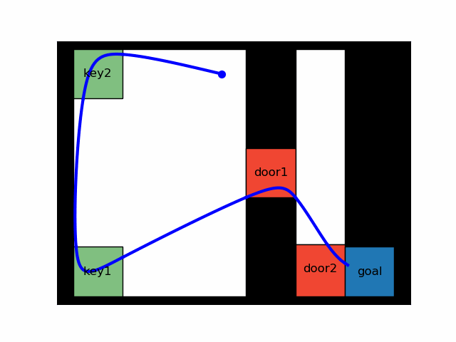

# Linear Temporal Logic Motion Planning via Graphs of Convex Sets

This repository contains code to accompany the paper *Temporal Logic Motion
Planning with Convex Optimization via Graphs of Convex Sets* by Vince Kurtz and
Hai Lin. 

## Installation

## Dependencies
- pydrake
- mona
- ltlf2dfa
- treelib
- unittest
- matplotlib
- scipy
- sympy
- numpy
- graphviz
- pydot
- pickle

## Examples

The following examples and several other can be found in the `examples`
directory.

Don't pass through a door until picking up a corresponding key, and eventually
reach a goal:

$$
\varphi = (\lnot door\_1 \mathsf{U} key\_1) \land (\lnot door\_2 \mathsf{U} key\_2) \land \lozenge goal
$$

The same specification, but with more keys and doors:

$$
\varphi = \bigwedge\_{i=1}^5 (\lnot d\_i \mathsf{U} k\_i) \land \lozenge goal
$$

